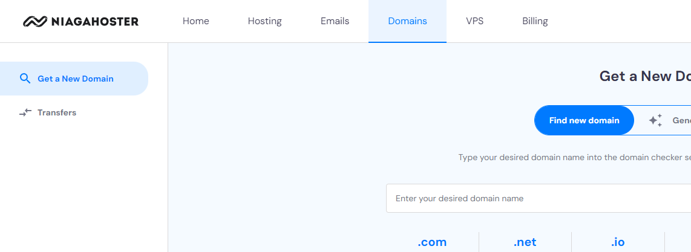
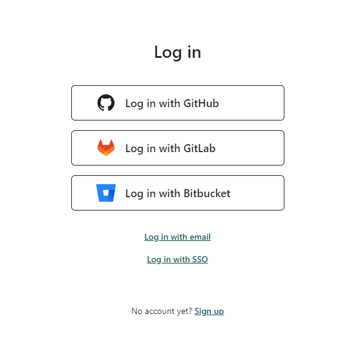

# Hello there! :raised_hand_with_fingers_splayed:
My deployement website: [Here:rocket:](https://webdevelop.tech/). The music webapp for people who loved drum. Let's Rock! :drum: :guitar:

I want to tell you how to use your customize website domain name. There is bunchs of tools to deploy your website. But I will show you only use netlify.
I break the tutorial into 3 steps:
- [Get The Domain:earth_asia:](#get-the-domainearth_asia)
- [Set Your Domain to Netlify:man_mechanic:](#set-your-domain-to-netlifyman_mechanic)
- [Deploy Your Website:rocket:](#deploy-your-websiterocket)

## Get The Domain:earth_asia:

1. I used niagahoster to buy a domain [here](https://www.niagahoster.co.id/).

   

2. You can login with your email and do few step of verification.
3. After login, you see the dashboard site of user niagahoster at home section. You can go to **"Domains"** site at navigation bar.

   

4. In the text input, you can find your suitable domain in that text input. Choose the TLD that nice for you and your wallet. Then simply press **"Buy now"**.

   

5. Choose best plan as you need. Click **Choose Payment Mehode"** and follow the easy few step of the payment.

   

6. Just follw all step untill you see this nice page. Finally go to email to check the verification.

   

## Set Your Domain to Netlify:man_mechanic:

1. Sign up to netlify [here](https://app.netlify.com/). Its realy ezz step, everyone can do it right. I login to netlify using **Github** account.

   

2. Select domain page

   

3. Input your domain at Niagahoster.

   

4. Verify your domain name.

   

5. Add your DNS record.

   

6. Input your DNS record to the Netlify.

   

7. Congrats _gess!_ You already register your domain at Netlify!

   

## Deploy Your Website:rocket:

1. Go to **side** page

   

2. Select **Deploy with GitHub**.

   

3. Select your repository.

   

4. Finally configure your website! Just follow the steps in that pages. And wait 3 until 24 hours for implement DNS configuration.

   

Theres all the easy way to customize your website. If you got problem, I suggest you to seek the solution at [google](https://www.google.com/search?q=why+my+customize+dns+not+working+netlify&sca_esv=580360740&sxsrf=AM9HkKkW1RltBbCc005tJ6wyEH1gOslSOQ%3A1699414701779&source=hp&ei=rQJLZf_2LdXcseMPyOqc-A4&iflsig=AO6bgOgAAAAAZUsQvR1cP7VD7OV2PxnGdRp5z-8JzYdz&oq=why+my+customize+dns+not+wek&gs_lp=Egdnd3Mtd2l6Ihx3aHkgbXkgY3VzdG9taXplIGRucyBub3Qgd2VrKgIIATIHECEYoAEYCjIHECEYoAEYCkjVfFC-BViYZnADeACQAQCYAfQBoAGMGqoBBzE0LjE1LjG4AQHIAQD4AQGoAgrCAgcQIxjqAhgnwgINEC4YxwEY0QMY6gIYJ8ICBxAjGIoFGCfCAggQABiKBRiRAsICCxAAGIAEGLEDGIMBwgINEAAYigUYsQMYgwEYQ8ICBBAjGCfCAggQABiABBixA8ICCxAuGIoFGLEDGJECwgIFEC4YgATCAgsQLhiKBRixAxiDAcICCBAuGIAEGLEDwgIEEAAYA8ICCxAuGIAEGLEDGIMBwgIFEAAYgATCAgYQABgWGB7CAggQABiKBRiGA8ICCBAhGBYYHhgd&sclient=gws-wiz). If you dont get any solution, please contact your TL or ask the [Instruction](https://www.linkedin.com/in/aditya-pradita-7937a7108/).
